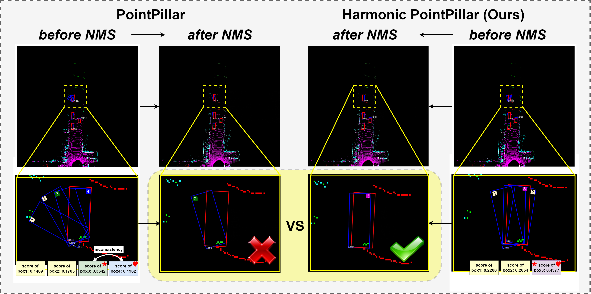

# TT3D: Time-friendly-and-Task-consistent-3D-Object-Detection
  
## Notification  

Our proposed **3D Harmonic Loss** can be applied to many lidar-based 3D object detection methods for solving inconsistency problem as shown below.

Paper in ArXiv: [PDF](https://arxiv.org/pdf/2211.03407.pdf) (Submitted to IEEE TVT)

Our implementation is relied on [mmdetection3D](https://github.com/open-mmlab/mmdetection3d)

## Environment    
python = 3.7  
pytorch = 1.6    
CPU: i7-10700K  
GPU: RTX-2080Ti  
other requriements are same as in [mmdetection3D](https://github.com/open-mmlab/mmdetection3d)

## Dataset Preparation  
Please follow the  [mmdetection3D](https://github.com/open-mmlab/mmdetection3d) to convert KITTI Dataset and Waymo Dataset     

## Training   
Note that our 3D harmonic loss optimization can be implemented to train almost all anchor-based 3D detectors without inference time cost.
Please get familar with mmdetection3D-format config in advance, and then you can check `configs/_base_/models/hv_second_secfpn_kitti_harmonic_loss.py` as an example to customize other model configs, and use our revised anchor-head with harmonic loss for 3D detectors. You can follow official document of [mmdetection3D](https://github.com/open-mmlab/mmdetection3d) to know how to configurate configs and train models.          
## Test
You can follow official document of [mmdetection3D](https://github.com/open-mmlab/mmdetection3d) to test models.            

## TODO Lists
- [ ] Readme Completion
- [X] Paper Preprinted
- [X] Support KITTI Dataset
- [X] Support Waymo Dataset
